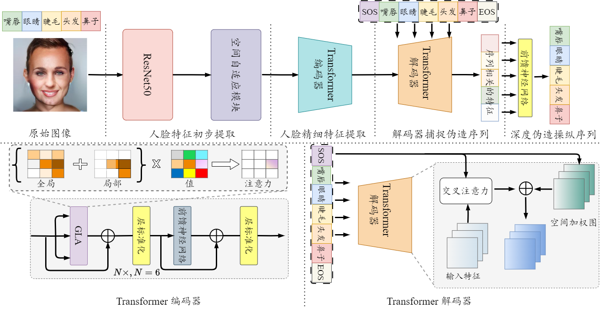

# 深度伪造人脸序列检测实验方案设计


## Introduction
针对数字图像处理、模式识别课程缺少高阶性、创新性和挑战度的应用案例问题, 设计了一个深度伪造人脸序列检测实验方案，用以解决深度伪造图像序列检测不能精确的检测出伪造操作顺序的难题。该实验搭建了伪造序列检测的深度学习模型，通过引入了空间自适应模块，检测难以察觉的细微不一致和伪影。此外，设计了一个全局-局部注意力模块，更准确地定位被操纵的区域。最终所训练的网络模型在测试集上的检测精度能达到72.46%。通过该实验方案的设计，可以拓展学生对深度人脸伪造检测的理解，提高学生科研探索的兴趣和解决实际工程问题的能力。

所设计的网络如图所示:

<div align="center">

</div>

## Deepfake Detection and Sequential Deepfake Detection 


<!-- <div align="center">

</div> -->


### Download
```
git clone git@github.com:guishengzhanga/SFGLA.git
cd SAGLA
```

## Results

#### Facial Components Manipulation
| Method            |  Fixed-Acc ${\uparrow}$ | Adaptive-Acc ${\uparrow}$
| ----------------- | :---:             | :---: 
| [DRN](https://arxiv.org/abs/1906.05856)               |  66.06            | 45.79 
| [Multi-Cls](https://arxiv.org/pdf/2207.02204.pdf)         | 69.65             | 50.57     
| [DETR](https://www.ecva.net/papers/eccv_2020/papers_ECCV/papers/123460205.pdf)              | 69.75             | 49.84     
| [MA](https://arxiv.org/abs/2103.02406)                | 71.31             | 52.94 
| [SeqFakeFormer](https://arxiv.org/pdf/2207.02204.pdf)      |  71.58            | 53.62 
|  SAGLA-Net (our)  |  **72.46**        | **54.78** 

#### Facial Attributes Manipulation
| Method            |  Fixed-Acc ${\uparrow}$ | Adaptive-Acc ${\uparrow}$
| ----------------- | :---:             | :---: 
| [DRN](https://arxiv.org/abs/1906.05856)              | 64.42             | 43.20 
| [Multi-Cls](https://arxiv.org/pdf/2207.02204.pdf)         | 66.66             | 46.00     
| [DETR](https://www.ecva.net/papers/eccv_2020/papers_ECCV/papers/123460205.pdf)              | 67.62             | 47.99     
| [MA](https://arxiv.org/abs/2103.02406)                | 67.58             | 47.48 
| [SeqFakeFormer](https://arxiv.org/pdf/2207.02204.pdf)     | 68.12             | 48.58 
|  SAGLA-Net (our)  |  **68.57**        | **49.21** 

<!-- ## Citation -->
<!-- If you find this work useful for your research, please kindly cite our paper:
```
@inproceedings{zhang2024space,
  title={Space-Frequency and Global-Local Attentive Networks for Sequential Deepfake Detection},
  author={Guisheng, Zhang and Qilei, Li and Mingliang, Gao and Siyou, Guo and Gwanggil, Jeon and Ahmed, M. Abdelmoniem},
  journal={under_review},
  year={2024},
}

``` -->
# Acknowledgements
 
 Thanks to the code available at https://github.com/rshaojimmy/SeqDeepFake.

[//]: <## Acknowledgements>